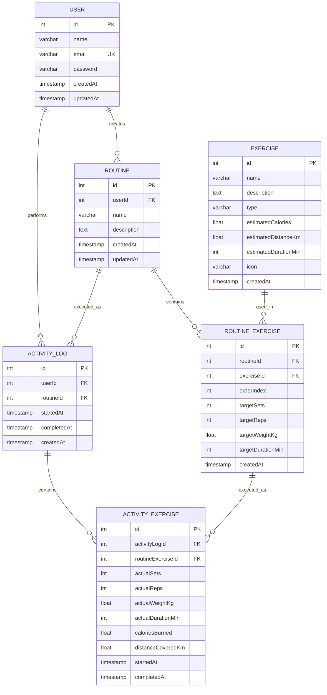

Para correr en modo Standalone:

```bash
mvn clean compile exec:java
```

Diagrama relacional de la App:


```mermaid
erDiagram

    USER {
        int id PK
        varchar name
        varchar email UK
        varchar password
        timestamp createdAt
        timestamp updatedAt
    }

    EXERCISE {
        int id PK
        varchar name
        text description
        varchar type
        float estimatedCalories
        float estimatedDistanceKm
        int estimatedDurationMin
        varchar icon
        timestamp createdAt
    }

    ROUTINE {
        int id PK
        int userId FK
        varchar name
        text description
        timestamp createdAt
        timestamp updatedAt
    }

    ROUTINE_EXERCISE {
        int id PK
        int routineId FK
        int exerciseId FK

        int orderIndex

        int targetSets
        int targetReps
        float targetWeightKg
        int targetDurationMin

        timestamp createdAt
    }

    ACTIVITY_LOG {
        int id PK
        int userId FK
        int routineId FK

        timestamp startedAt
        timestamp completedAt

        timestamp createdAt
    }

    ACTIVITY_EXERCISE {
        int id PK

        int activityLogId FK
        int routineExerciseId FK

        int actualSets
        int actualReps
        float actualWeightKg
        int actualDurationMin

        float caloriesBurned
        float distanceCoveredKm

        timestamp startedAt
        timestamp completedAt
    }

    USER ||--o{ ROUTINE : creates

    USER ||--o{ ACTIVITY_LOG : performs

    ROUTINE ||--o{ ROUTINE_EXERCISE : contains

    EXERCISE ||--o{ ROUTINE_EXERCISE : used_in

    ROUTINE ||--o{ ACTIVITY_LOG : executed_as

    ACTIVITY_LOG ||--o{ ACTIVITY_EXERCISE : contains

    ROUTINE_EXERCISE ||--o{ ACTIVITY_EXERCISE : executed_as
```